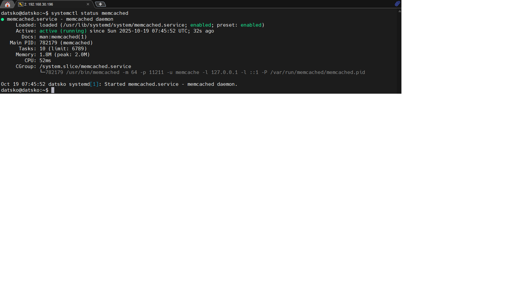
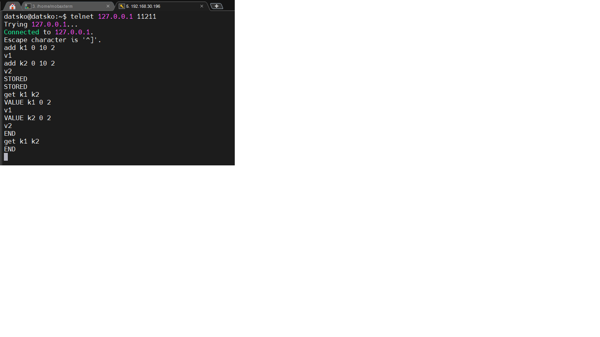
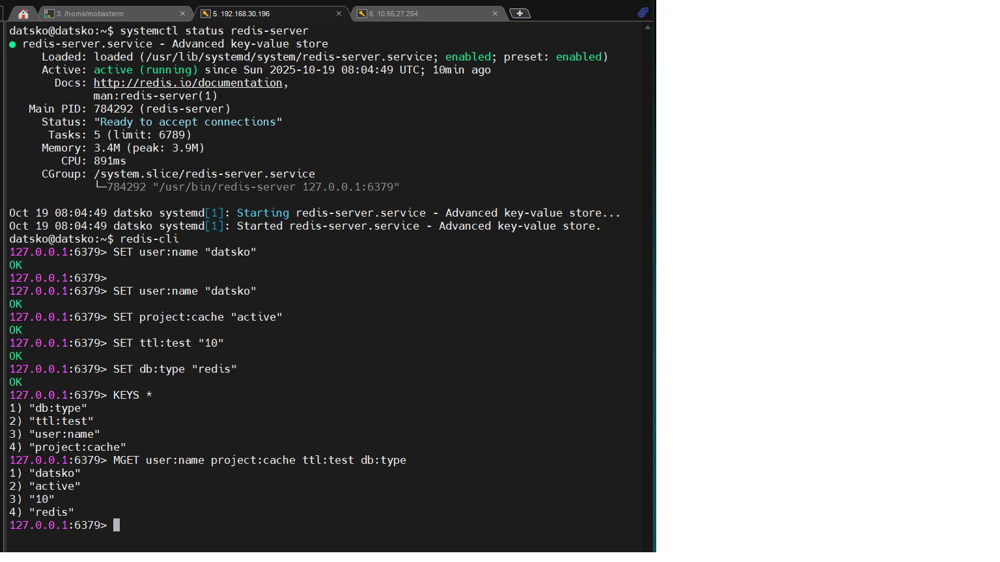

# Домашнее задание к занятию "`Кеширование Redis/memcached`" - `Дацко Иван`

### Инструкция по выполнению домашнего задания

   1. Сделайте `fork` данного репозитория к себе в Github и переименуйте его по названию или номеру занятия, например, https://github.com/имя-вашего-репозитория/git-hw или  https://github.com/имя-вашего-репозитория/7-1-ansible-hw).
   2. Выполните клонирование данного репозитория к себе на ПК с помощью команды `git clone`.
   3. Выполните домашнее задание и заполните у себя локально этот файл README.md:
      - впишите вверху название занятия и вашу фамилию и имя
      - в каждом задании добавьте решение в требуемом виде (текст/код/скриншоты/ссылка)
      - для корректного добавления скриншотов воспользуйтесь [инструкцией "Как вставить скриншот в шаблон с решением](https://github.com/netology-code/sys-pattern-homework/blob/main/screen-instruction.md)
      - при оформлении используйте возможности языка разметки md (коротко об этом можно посмотреть в [инструкции  по MarkDown](https://github.com/netology-code/sys-pattern-homework/blob/main/md-instruction.md))
   4. После завершения работы над домашним заданием сделайте коммит (`git commit -m "comment"`) и отправьте его на Github (`git push origin`);
   5. Для проверки домашнего задания преподавателем в личном кабинете прикрепите и отправьте ссылку на решение в виде md-файла в вашем Github.
   6. Любые вопросы по выполнению заданий спрашивайте в чате учебной группы и/или в разделе “Вопросы по заданию” в личном кабинете.
   
Желаем успехов в выполнении домашнего задания!
   
### Дополнительные материалы, которые могут быть полезны для выполнения задания

1. [Руководство по оформлению Markdown файлов](https://gist.github.com/Jekins/2bf2d0638163f1294637#Code)

## Задание 1. Кеширование

Кеширование решает следующие проблемы:
- **Повышение производительности** за счёт хранения часто запрашиваемых данных в быстрой памяти.
- **Ускорение ответа приложения** — данные отдаются из кэша, а не генерируются или запрашиваются из медленных источников (БД, API).
- **Снижение нагрузки на базу данных** — особенно при тяжёлых или часто повторяющихся запросах.
- **Сглаживание всплесков трафика** (например, во время акций или распродаж), когда система не справляется с пиковыми нагрузками без кэша.
- **Экономия ресурсов** — меньше обращений к внешним сервисам, меньше вычислений на стороне сервера.

---

## Задание 2. Memcached

Установлен и запущен `memcached` на Ubuntu 24.04.3 LTS.  
Служба активна и работает на порту `11211`.

Скриншот подтверждающий запуск:

---

## Задание 3. Удаление по TTL в Memcached

В `memcached` записаны два ключа (`k1`, `k2`) со значением длиной 2 байта и TTL = 10 секунд.  
Сразу после записи ключи присутствуют в кэше.  
Через 11 секунд — оба ключа автоматически удалены (не возвращаются при `get`).

Скриншот демонстрирует:
- успешную запись (`STORED`),
- наличие ключей при первом `get`,
- отсутствие ключей при повторном `get` после истечения TTL.

---

## Задание 4. Запись данных в Redis

В Redis записаны 4 ключа:
- `user:name`
- `project:cache`
- `ttl:test`
- `db:type`

С помощью `redis-cli` выполнены команды:
- `KEYS *` — для получения списка всех ключей,
- `MGET ...` — для получения всех значений.

Скриншот подтверждает успешную запись и чтение данных.

